# Large Language Model Quantization: как уменьшить размеры моделей и сохранить их работоспособность

## Введение

Здравствуйте, сегодня я хочу рассказать вам о том как уменьшить размеры моделей и сохранить их работоспособность

но сначала нужно поговорить о том как вообще работают большие языковые модели и почему они такие объемные.
Далее рассмотрим основы квантизации, различные техники квантизации, а также преимущества и недостатки моделей сниженной точности и как можно найти и использовать уже квантизованные модели.

## Векторное представление слов (Esto no)

Существует множество способов представления слов в векторной форме. Самый простой способ - это one-hot encoding, когда каждое слово представляется вектором, в котором все элементы равны нулю, кроме одного, соответствующего индексу слова в словаре.
Естественно, такое представление не учитывает семантическую близость слов. Так в 2013 году была предложена техника word2vec, которая позволяет представить слова в векторном пространстве так, что семантически близкие слова будут иметь близкие вектора.

[text](https://neerc.ifmo.ru/wiki/index.php?title=%D0%92%D0%B5%D0%BA%D1%82%D0%BE%D1%80%D0%BD%D0%BE%D0%B5_%D0%BF%D1%80%D0%B5%D0%B4%D1%81%D1%82%D0%B0%D0%B2%D0%BB%D0%B5%D0%BD%D0%B8%D0%B5_%D1%81%D0%BB%D0%BE%D0%B2)

Всё таки такое представление не учитывает контекст слова, его местоположение в предложении и другие семантические особенности.

## Веса и активации

При работе нейронной сети каждый нейрон в каждом слое принимает на вход какое-то значение, в нашем случае вектора слов, перемножает на веса и применяет к ним функцию активации. Веса - это параметры модели, которые определяют, как модель будет обрабатывать входные данные. Активации - это функции, которые определяет выходной сигнал нейрона и передают сигнал на вход следующему слою.

Здесь мы можем увидеть веса и активации в нейронной сети. Веса в данном случае представляются связями между нейронами, а активации - это функции которые применяются к входным данным. Как видим все веса и активации представлены в виде матриц и векторов. Поэтому, все действия в нейронной сети - это перемножение матриц и векторов.
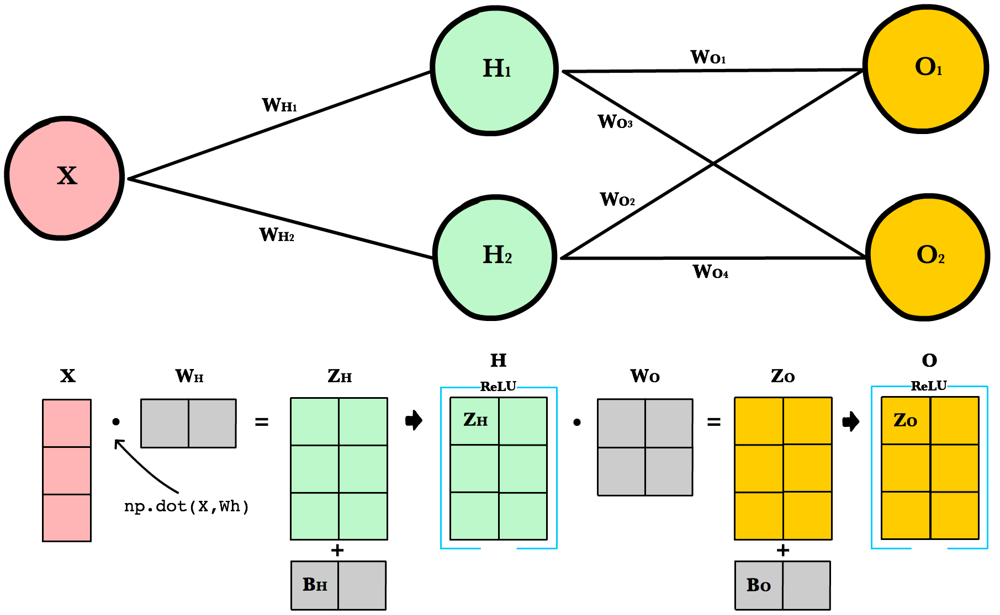

## Трансформеры

Поэтому, для решения данной проблемы были разработаны трансформеры. Трансформеры - это архитектура нейронной сети, которая позволяет учитывать контекст слова, его местоположение в предложении и другие семантические особенности с помощью механизма внимания.

Самое главное что нужно знать о трансформерах - это то что каждый слой трансформера состоит из двух шагов для обработки каждого слова входного текста: механизма внимания и feed-forward слоя.

### Слой встраивания слов

Слой встраивания слов преобразует слова в вектора, которые могут быть обработаны трансформером.

### Attention heads

На этом слое каждое слово входного текста создает вектор запроса, описывающий характеристики слов которые ему интересны и вектор ключа, описывающий характеристики слов в тексте. Так сеть сравнивает каждый ключевой вектор с каждым вектором запроса (вычисляя скалярное произведение), чтобы найти наилучшие соответствия слов. Как только она находит соответствие, она передает информацию от слова, которое создало ключевой вектор, к слову, которое создало вектор запроса.

### Feed-forward layer

Feed-Forward слой позволяет сети воспринимать шаблоны в данных, которые могут быть использованы для предсказания.

## Параметры моделей

И так все эти слои представляют собой параметры модели.
Параметры модели - это значения, которые определяют, как модель будет обрабатывать входные данные. Веса модели обучаются с помощью алгоритма обратного распространения ошибки, который минимизирует ошибку модели на обучающем наборе данных.

Зачем нам это нужно знать для квантизации моделей? Потому что параметры модели занимают большое количество памяти, и уменьшение их размера позволяет ускорить работу модели и уменьшить ее энергопотребление.
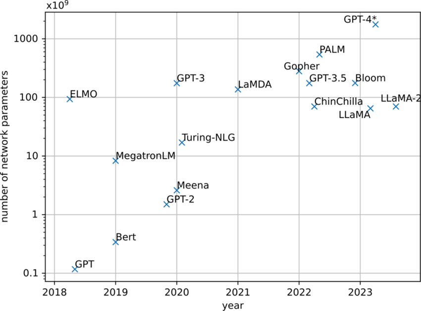

Так например, модель GPT-3, который включает в себя 12288-мерные векторы слов и 96 слоев имеет 175 миллиардов параметров и весит 350 Гб.
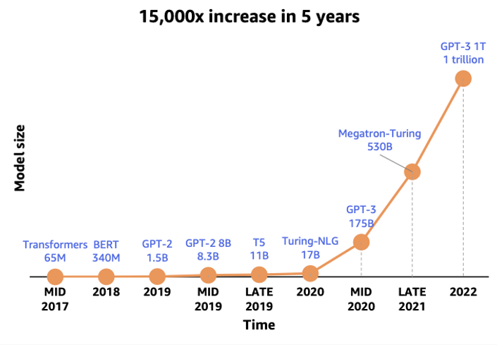

## Квантизация

Начнем с того, что такое квантизация. Квантизация — это процесс преобразования значений из представления с большим объёмом информации (обычно непрерывного множества) в более компактное представление, обычно в дискретное множество. Наглядный пример квантизации — дискретизация аналогового сигнала, когда каждому значению непрерывного сигнала присваивается значение из заранее определённого дискретного множества.

В контексте нейронных сетей квантизация означает уменьшение точности весов модели. Так, например, вместо хранения весов в 32-битных числах, можно хранить их в 8-битных числах.

Но при этом возникает проблема, что при уменьшении точности весов модель может потерять в качестве.

## Типы данных

Обычно параметры моделей хранятся в 32-битных числах с плавающей точкой. В квантизованных моделях параметры хранятся в half-precision (16-битных числах с плавающей точкой), или даже в 8-битных целых числах.

В квантизованных моделях обычно присутствуют два типа данных:
 - Quantized type — в этом типе хранят тензоры;
 - Computation type — в этом типе проводят вычисления

К сожалению, эти два типа не всегда совпадают. Например, ваше железо может не поддерживать операции в quantized type. Эффективных кернелов перемножения матриц под квантизованный тип может просто не существовать. В таких случаях перед вычислениями матрицу нужно конвертировать в computation type. Также computation type позволяет избежать проблем с переполнением в активациях, так как перемножение 8-битных чисел наверняка приведёт к выходу за границы типа.

Разберём устройство некоторых интересных типов данных

### float32
Вещественный тип float32. В нем обычно проводятся тренировки моделей. Здесь битовое представление выглядит так: 1 бит знака, 8 — экспоненты, 23 — мантиссы.

### bfloat16 или brain float
Специальный формат данных, разработанный Google Brain. Можно рассматривать как аппроксимацию float32. Битовое представление такое: 1 бит знака, 8 — экспоненты и 7 — мантиссы.

Здесь интересно то что число битов под экспоненту совпадает с представлением float32. Значит, bfloat16 представляет тот же диапазон значений, пусть и менее точно. Зато можно меньше опасаться переполнений в активациях.

Другая приятная особенность bf16 — возможность быстро конвертировать значения во float32. Магия работает благодаря сходному битовому представлению. К сожалению, пока что не всё железо работает с этим типом (особенно мобильное).

### TensorFloat32
19-битный тип данных от Nvidia совпадающий с float32 по рангу. Поддерживается в архитектурах, начиная с Nvidia Ampere (A-100). Битовое представление: 1 бит знака, 8 — экспоненты, 10 — мантиссы.

### NF4
Normal Float 4 - пример построения 4-битного типа данных. Мы знаем, что веса сетей распределены нормально и сконцентрированы около нуля. Авторы статьи QLORA утверждают, что NF4 теоретически оптимален для квантизации значений из нормального распределения N(0, 1) на отрезке [-1, 1]
Этот тип данных строится с помощью разделения значений на квантИли и присвоения каждому квантИлю своё значение между -1 и 1.
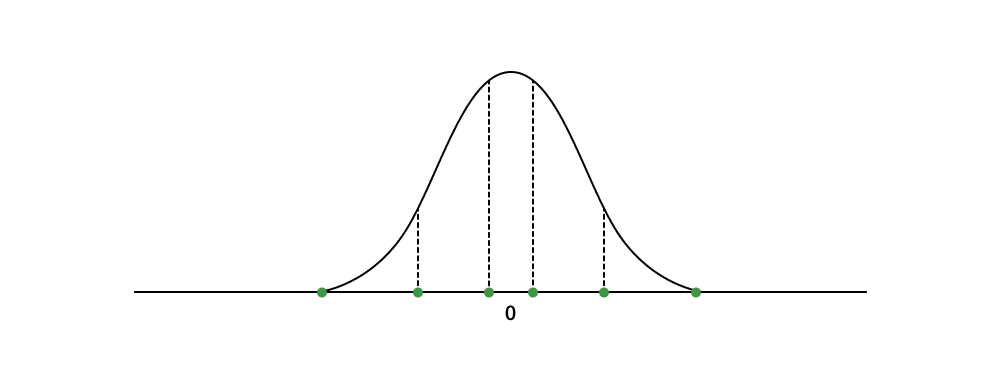

## Подходы к квантизации
Существуют разные подходы к квантизации. Например, через кластеризацию или факторизацию матриц.
Но сейчас мы сосредоточимся на линейной квантизации как на самом популярном методе.

~~(Квантизация через кластеризацию группирует весы в кластеры. Затем каждому кластеру присваивается уникальное значение, которое заменяет все значения в этом кластере. Квантизация через факторизацию матриц, аппроксимирует исходную матрицу с помощью произведения двух низкоранговых матриц.)~~

### Аффинная квантизация
Аффинная, или несимметричная, квантизация отображает несимметричный диапазон в k-битный тип данных. Рассмотрим вещественный диапазон значений [R_{min}, R_{max}]

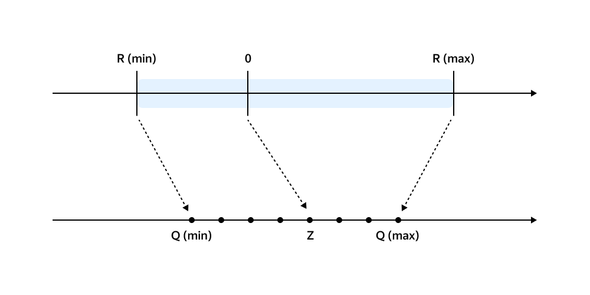

Так находим квантизованные значения по формуле:
X_q = round(X/S + Z), (квантизованное значение равно округленному отношению изначального параметра к значению scale плюс zero-point)

где S = (R_{max} - R_{min}) / (q_{max} - q_{min}), (scale равен разнице между максимальным и минимальным значением весов, деленной на разницу между максимальным и минимальным значением квантизованных весов)

Z = round(q_{min} - R_{min} / S) (zero-point равен округленному значению минимального значения весов минус минимальное значение квантизованных весов деленное на scale)
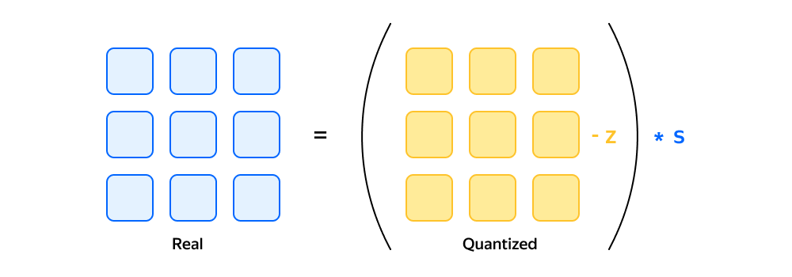
(Aca iria tambien el ejemplo de excel)

### Симметричная квантизация
Симметричная квантизация отображает симметричный относительно нуля диапазон.
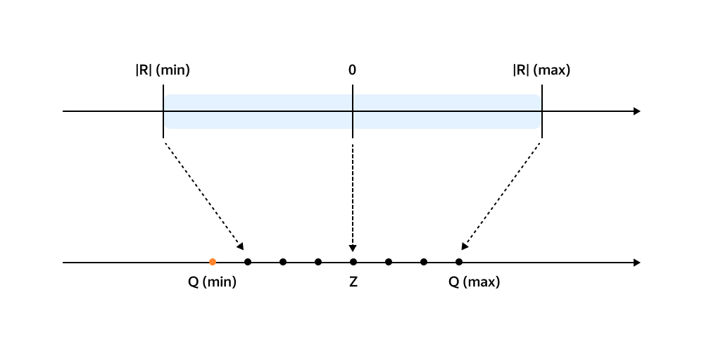

Ноль вещественного типа переходит в ноль квантизованного. Границы квантизируемого диапазона определяют как максимальное по модулю квантизируемое значение |R_{max}|
Чтобы тип получился симметричным, нужно отказаться от одного значения в квантизованном типе данных. То есть, диапазон signed int8: [-128, 127] превратится в [-127, 127].

Так находим квантизованные значения по формуле:
X_q = round(X/S), (квантизованное значение равно округленному отношению изначального параметра к значению scale)

где S = |R_{max}| / 2^{N-1} - 1 (scale равен максимальному по модулю значению весов деленному на 2 в степени N-1 минус 1)
Z = 0 (zero-point равен нулю)

Отличие от формул аффинной квантизации состоит в отсутствии Z. Преимущества аффинной квантизации — она умеет точнее и лучше справляться с асимметричными распределениями, в то время как симметричная квантизация выигрывает за счёт простоты и скорости. При таком подходе не нужно думать о хранении zero-point, а для деквантизации достаточно умножить тензор на константу.

### Проблема выбросов
Одна из проблем квантизации - это выбросы. Выбросы - это значения, которые сильно отличаются от среднего значения. 
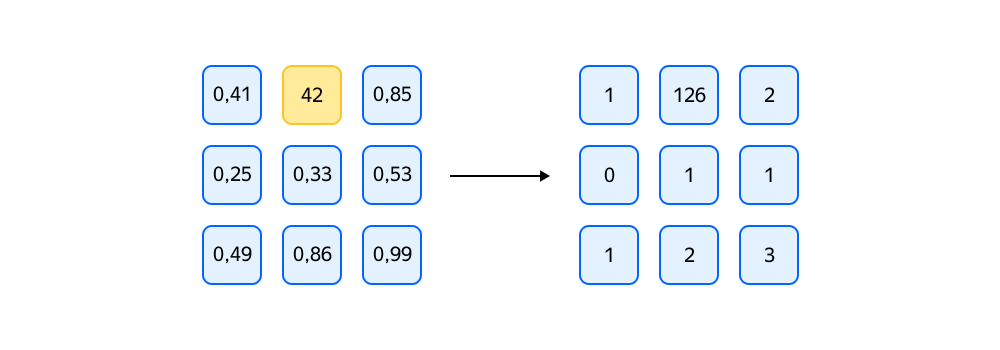
На примере рисунка видно, что при квантизации веса «склеились» в узкий диапазон и стали неотличимы. Качество модели потеряно. Так единственный выброс испортил всю матрицу.

Выбросы составляют всего 0,1–1% от всех значений. Первое, что приходит в голову — попробовать избавиться от выбросов, например, обнулив их. Но это не всегда хорошая идея. Выбросы могут быть важными для модели. Например, в задаче обнаружении аномалий выбросы и есть аномалии. Поэтому нужно искать другие способы борьбы с выбросами.

### LLM.Int8
Данный метод квантизации переводит веса модели в 8-битные целые числа практически без потерь качества. В этом методе рассматривается умножение весов W на матрицу активаций X. Матрица X делится на столбцы которые содержат хотя бы один выброс и столбцы без выбросов.
Так как каждый столбец матрицы X взаимодействует только с одним столбцом матрицы W, то можно однозначно разделить матрицу W на две.

Теперь можно отдельно произвести матричное умножение для выбросов с использованием float16 (или изначальный тип данных) а для остальных столбцов использовать int8 (или желаемый тип данных) для более быстрого вычисления. В конце производится объединение результатов в изначальном формате данных с помощью деквантизации тех значений которые были преобразованными.

### SmoothQuant

В статье описывающей данный метод, утверждается что в матрицах весов проблем с выбросами не бывает, так как их значения почти всегда приближены к нормальному, сосредоточено около нуля и не содержит выбросов.
Однако с активациями ситуация иная. Активации обычно содержат выбросы, которые могут быть важными для модели. Поэтому важно сохранить их. Они часто могут отличатся друг от друга в 100 и более раз.

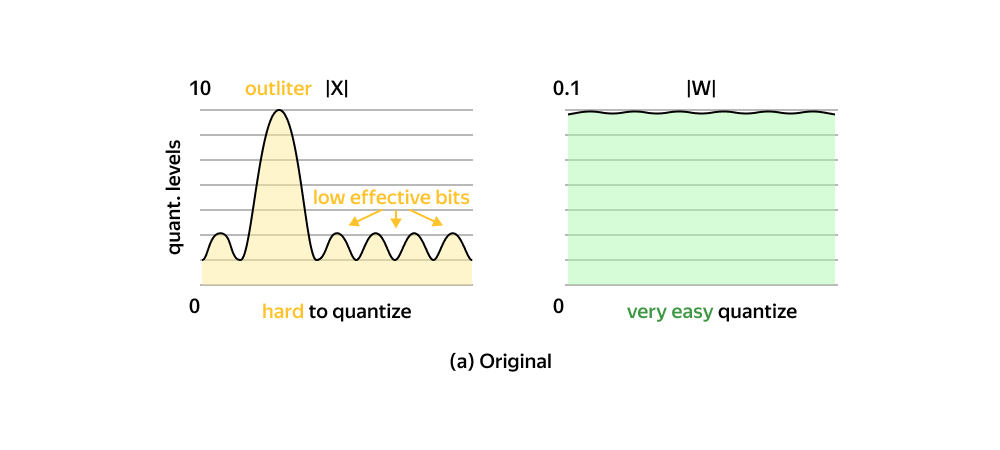

Для этого используется метод SmoothQuant. Он заключается в том, что они сглаживают выбросы в активациях за счет такого параметра s (smoothing factor), на который делятся выбросы в матрицах активаций и умножается на соответствующие веса.
Этот фактор s находится следующим образом
sj = max(|Xj |)α/ max(|Wj |)1−α (параметр s равен максимальному значению в столбце активаций в степени α деленное на максимальное значение в столбце весов в степени 1-α,
где α — это параметр, который можно подбирать, но авторы статьи рекомендуют использовать 0.5)

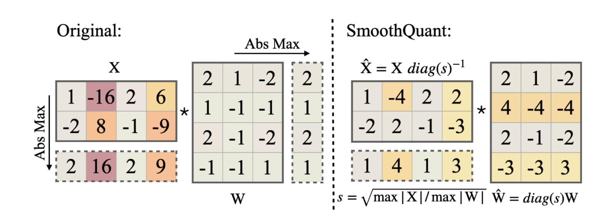

Таким образом обе матрицы активаций и весов будут намного ближе к нормальному распределению и не будут содержать выбросов.

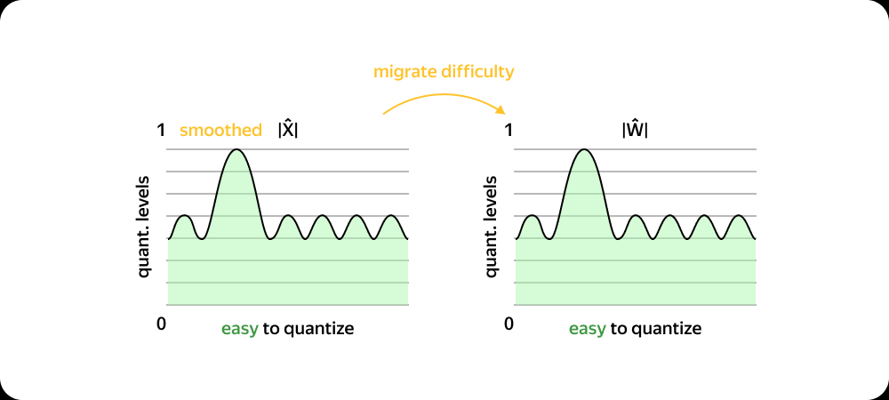

Прелесть метода заключается в том, что все эти операции проходят в офлайне. Константы s можно поставить в матрицы весов. Для матриц активаций — просто вставляются соответствующие константы в матрицу весов. Таким образом, нет никаких накладных расходов во время работы нейронной сети.

В отличие от LLM.Int8, SmoothQuant не делит матрицу активаций на столбцы с выбросами и столбцы без них. И как утверждают авторы статьи, метод SmoothQuant не зависит от выбора hardware и быстрее работает.

## Post-Training Quantization (PTQ)
До этого момента мы рассматривали только как квантизовать модели. Но на каком этапе это делать?
Post-Training Quantization (PTQ) — это простой метод квантизации, который применяется после обучения модели. Этот метод прост в реализации, так как не требует новых данных для обучения и можем применить для всех уже обученных моделей. Однако, PTQ может привести к потере качества модели. Все раннее описанные методы квантизации относятся к PTQ.

Согласно авторам статьи GPTQ, с этим методом можно добиться уменьшения размеров параметров моделей с 3 миллиардами параметров только за 5 минут на единственном GPU NVIDIA A100, а модель с 175 миллиардами параметров за 4 часа.

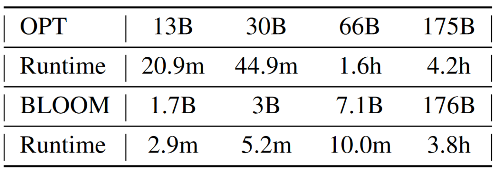

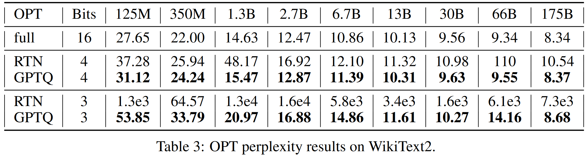
(Перплексия в нейронных сетях - это мера, используемая для оценки того, насколько хорошо вероятностная модель предсказывает выборку. В более простых терминах, она указывает, насколько хорошо данная вероятностная модель или языковая модель предсказывает конкретный набор данных. Чем ниже перплексия, тем лучше модель работает в точном предсказании данных, на которых она обучалась. Она напрямую связана с неопределенностью и непредсказуемостью языковой модели, служа таким образом важной оценочной метрикой в области искусственного интеллекта.)

## Quantization-Aware Training (QAT)

QAT - это метод квантизации, который применяется во время обучения модели. Этот метод сложнее в реализации, так как требует новых данных для обучения. Однако, QAT может привести к меньшей потере качества модели по сравнению с PTQ.
Рассмотрим QAT на примере QLORA.

### QLORA

QLORA - это метод квантизации, который позволяет уменьшать размеры моделей с минимальной потерей качества за счет fine-tuning с помощью LoRA. Такой результат достигается за счет использования **4-bit Normal Float (NF4)** для хранения весов модели, bfloat16 для вычислений, **двойной квантизации** который квантизирует константы квантизации (и позволяет сохранить 65 миллиардную модель используя только 3 гигабайта памяти), и **paged optimizers** для автоматического перемещения данных между CPU и GPU в случае нехватки памяти.
Таким образом, output каждого слоя модели определяется этой формулой.

(Здесь YBF16 - это выход слоя, XBF16 - вход, а L1BF16 и L2BF16 - параметры адаптера LoRA. Функция doubleDequant применяется к весам квантованной базовой модели, представленным WNF4, а также к двум константам квантования, c1FP32 и c2k−bit.)

#### Результаты QLORA

На этой таблице представлены результаты QLORA по сравнению с другими моделями. Модель с методом QLORA называется Guanaco. Как видно, Guanaco показывает лучшие результаты для своей соответствующей группе с одинаковым количеством параметров.
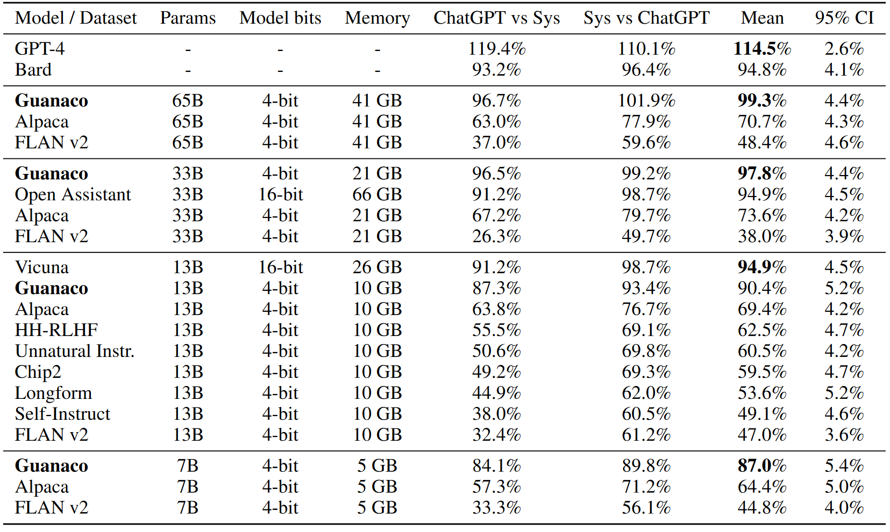

## Использование квантизованных моделей

Как можно использовать квантизированные модели? Можно самому квантизировать модели, но это сложно так как даже используя уже готовые библиотеки и методы, часто требуется использование дорогих видеокарт и много времени. Поэтому, лично я рекомендую использовать уже квантизированные модели от разработчиков. Для этого, вы можете установить программу LM Studio, которая позволяет найти модели из HuggingFace и практически без настроек использовать модели.

### Результат использования квантизированной модели

Вот пример использования квантизированной модели в LM Studio. Видно, что модель Guanaco использует 5.82 гигабайта видеопамяти. Я попросил написать решение для задачи по алгоритмам, и хотя конечный результат естественно не является правильным, он все равно придумал более менее логичное решение.
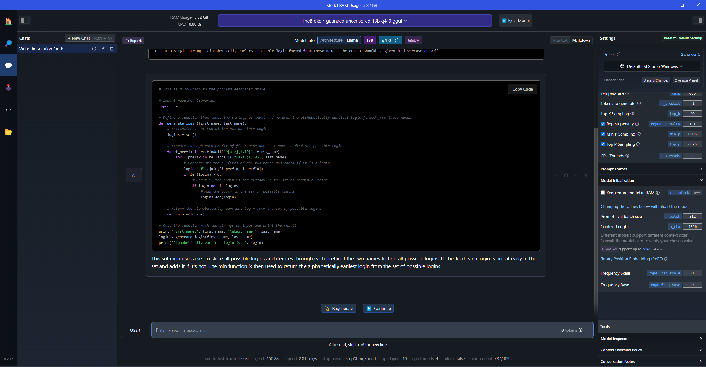

## Вопрос к экзамену
Квантизации в контексте машинного обучения - это процесс уменьшения точности вычислений, который позволяет уменьшить требования к ресурсам при выполнении моделей. PTQ и QAT - это два основных подхода к квантизации. Какие преимущества и недостатки методов квантизации Post-Training Quantization (PTQ) и Quantization-Aware Training (QAT)?

# Возможные вопросы от слушателей
1. Как именно оценивается качество модели после квантизации (что означают цифры в таблицах результатов)?
2. Как представляются слова в виде векторов, и как модель понимает семантическую близость слов?
3. Как решить какой тип данных использовать для квантизации?
4. Какие методы квантизации существуют помимо линейной квантизации?
5. Можно ли использовать квантизацию для уменьшения размера любой модели машинного обучения или только для определенных типов моделей?
6. Что такое LoRA и как он используется в QLORA?
7. Почему так важно оставлять выбросы при квантизации?
8. Для метода LLm.Int8, как выбираются столбцы с выбросами и без них?

## Ответы на возможные вопросы
1. Качество модели после квантизации оценивается с помощью перплексии. Перплексия измеряет, насколько хорошо модель может предсказать следующее слово в тексте. Если модель всегда точно знает, какое слово будет следующим, перплексия равна 1. Если модель всегда случайно выбирает следующее слово из всех возможных слов, перплексия равна числу возможных слов.
В случае результатов QLORA, авторы статьи решили сделать автоматизированную оценку, где они использовали GPT-4 для оценки производительности различных систем по сравнению с ChatGPT (GPT-3.5 Turbo) на бенчмарке Vicuna. Учитывая запрос вместе с ответами ChatGPT3.5 и модели, GPT-4 получает запрос на присвоение ответам оценку от одного до десяти с объяснением. Общая производительность модели рассчитывается как процент от оценки, полученной ChatGPT. Конечно это не самый точный способ оценки, но с другой стороны в отличие от перплексии, он позволяет оценить качество текста, а не только вероятность следующего слова.
2. Слова представляются в виде многомерных векторов, где семантическая близость слов определяется по косинусному расстоянию между векторами. Если косинусное расстояние между векторами слов мало, то слова считаются семантически близкими.
Модель с свою очередь понимает контекст в слоях внимания с помощью присвоения на каждом этапе каких то значений которые помогают модели понять какие слова важнее для предсказания следующего слова. Я говорю какие то значения, потому что внутренние процессы модели сложно понять так как они происходят внутри нейронной сети, то есть они не как не описываются в текстовом виде.
3. Нет четкого ответа на этот вопрос, так как выбор типа данных зависит от конкретной задачи и железа на котором будет работать модель. При уменьшении точности весов модели можно пробовать дальше уменьшать точность весов, пока не будет сильно ухудшено качество модели.
4. Кроме линейной квантизации существуют методы квантизации через кластеризацию и факторизацию матриц. Квантизация через кластеризацию группирует весы в кластеры. Затем каждому кластеру присваивается уникальное значение, которое заменяет все значения в этом кластере. Квантизация через факторизацию матриц, аппроксимирует исходную матрицу с помощью произведения двух низкоранговых матриц. Но я не знаком с этими методами, поэтому не могу дать более подробное описание.
5. Да, можно использовать. Тут самое главное это смотреть какие результаты дает модель после квантизации.
6. LoRA - это техника дообучения, которая использует уже обученные модели для решения более специфических задач. Вместо обновления всех параметров, LoRA “замораживает” веса предварительно обученной модели и вводит новые матрицы поменьше в каждый слой архитектуры Transformer. Так QLoRA может уменьшать размеры моделей и ухудшение качества компенсируется дообучением с LoRA.
7. Согласно разработчикам метода LLm.Int8, они увидели что зануление выбросов увеличивает значение перплексии на 6-10 раз, то есть модель если можно так сказать, в 6-10 менее уверена в своих предсказаниях, даже несмотря на то что выбросы составляют всего 0,1–1% от всех значений. В той же статье они попробовали занулить одну десятую процента параметров и значение перплексии увеличилось только в 1 процент. 
8. Эти выбросы могут выбираться по разному, иногда произвольно. Так например в методе LLm.Int8, авторы просто взяли значение порога равное 6. То есть каждый разработчик пробует свои методы для выбора столбцов с выбросами и без них. Возможно, что в будущем появятся более точные методы для выбора столбцов.

## Ссылки
 - https://www.mlq.ai/llm-transformer-architecture/
 - https://arstechnica.com/science/2023/07/a-jargon-free-explanation-of-how-ai-large-language-models-work/
 - https://neerc.ifmo.ru/wiki/index.php?title=%D0%92%D0%B5%D0%BA%D1%82%D0%BE%D1%80%D0%BD%D0%BE%D0%B5_%D0%BF%D1%80%D0%B5%D0%B4%D1%81%D1%82%D0%B0%D0%B2%D0%BB%D0%B5%D0%BD%D0%B8%D0%B5_%D1%81%D0%BB%D0%BE%D0%B2
 - https://ml-cheatsheet.readthedocs.io/en/latest/forwardpropagation.html
 - https://rpradeepmenon.medium.com/introduction-to-large-language-models-and-the-transformer-architecture-534408ed7e61
 - https://arxiv.org/pdf/1706.03762.pdf
 - https://www.tensorops.ai/post/what-are-quantized-llms#viewer-abo9e
 - https://arxiv.org/pdf/2210.17323.pdf
 - https://en.wikipedia.org/wiki/Perplexity
 - https://huggingface.co/docs/optimum/concept_guides/quantization#going-further-how-do-machines-represent-numbers
 - https://arxiv.org/pdf/1712.05877.pdf
 - https://arxiv.org/pdf/2305.14314.pdf
 - https://towardsdatascience.com/introduction-to-weight-quantization-2494701b9c0c
 - https://towardsdatascience.com/4-bit-quantization-with-gptq-36b0f4f02c34
 - https://habr.com/ru/companies/yandex/articles/800945/
 - https://huggingface.co/blog/hf-bitsandbytes-integration#accelerate-is-all-you-need
 - https://arxiv.org/pdf/2208.07339.pdf
 - https://arxiv.org/pdf/2211.10438.pdf
 - https://www.evanmiller.org/attention-is-off-by-one.html
 - https://arxiv.org/pdf/1803.03289.pdf
 - https://arxiv.org/pdf/2308.04595.pdf